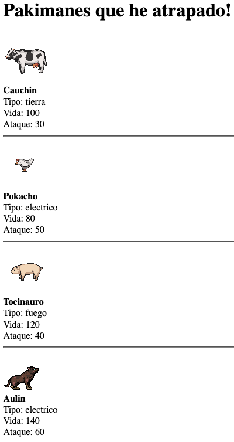

# Pakiman

Bienvenido! 👋

Creemos nuestro primer juego con lo que hemos aprendido, lo llamaremos Pakiman

Como todos nuestro Pakimanes van a compartir características, vamos a crear objetos para definirlos

Recuerda:
- Las clases son la definición de los objetos